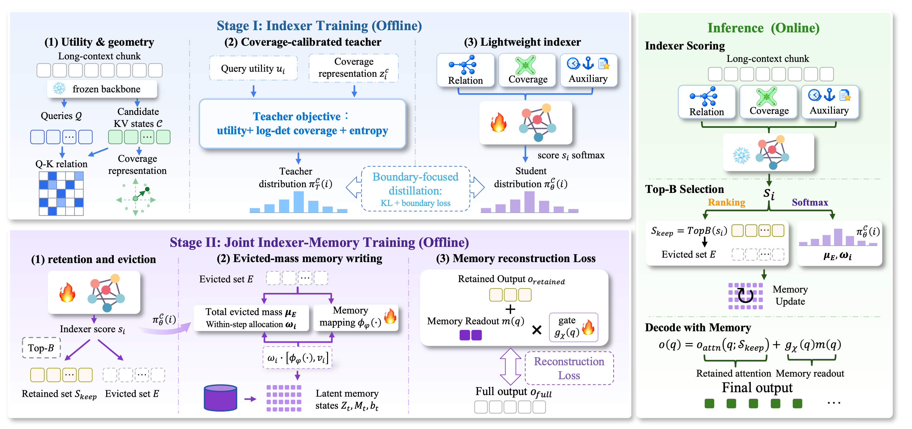

# One Distribution, Two Channels: Coverage-Calibrated KV Retention and Compensation

Anonymous code release for **CORE**, accompanying the submitted paper.

## 🌟 Overview

- **CORE unifies KV retention and compensation.** Existing fixed-budget methods often treat these decisions separately, while a retention ranking alone cannot describe how much attention is discarded or the direction of the resulting output error. CORE starts from an exact decomposition of eviction error into evicted attention mass and a directional gap.
- **CORE learns a coverage-calibrated allocation.** During offline training, a teacher combines query utility with log-determinant coverage to account for both relevance and complementary information. Boundary-focused distillation transfers this allocation to a lightweight, cache-aware indexer.
- **One distribution drives two channels at inference.** Its Top-B ordering selects the retained KV states, while its excluded mass and conditional weights determine latent-memory writes. A query-dependent, gated memory readout compensates for the attention residual, without a separate write-weight predictor or online log-determinant evaluation.

<p align="center">
  
  <br>
  <em>Overview of CORE.</em>
</p>

## Installation

Requires Linux, an NVIDIA GPU, and a compatible CUDA toolkit. Run all commands from the repository root.

```bash
conda create -n project_env python=3.10 -y
conda activate project_env
python -m pip install --upgrade pip setuptools wheel
python -m pip install torch==2.4.1 --index-url https://download.pytorch.org/whl/cu124
python -m pip install -r requirements.txt
python -m pip install 'flash-attn==2.7.4.post1' --no-build-isolation
```

Built on [KVPress](https://github.com/NVIDIA/kvpress). [`requirements.txt`](requirements.txt) installs the bundled version with evaluation dependencies and CORE's additional packages. The example uses CUDA 12.4; install FlashAttention last.

## Data Preparation

Download the backbone and datasets from the sources below; they are not included in this release. All paths are relative to the repository root.

| Resource | Purpose | Local path |
| :--- | :--- | :--- |
| [Llama-3.1-8B-Instruct](https://huggingface.co/meta-llama/Llama-3.1-8B-Instruct) | Backbone | `model/` |
| [LongAlpaca-12k](https://huggingface.co/datasets/Yukang/LongAlpaca-12k) | Training | `data/LongAlpaca-12k_.csv` |
| [RULER](https://github.com/NVIDIA/RULER) | Evaluation | `RULER/4096/`, `RULER/16384/` |
| [LongBench](https://github.com/THUDM/LongBench/tree/main/LongBench) | Evaluation | `data/longbench/` |

- **Backbone:** Obtain model access and authenticate locally if required. Keep the model configuration, tokenizer, weight index, and weight shards together in `model/`.
- **LongAlpaca-12k:** Export all 12,000 examples to CSV with columns `instruction`, `input`, and `output`. Use empty strings for missing fields and save without a row index.
- **RULER:** Prepare 13 tasks with 500 examples per task at each context length, using the paper's generation settings. Store Parquet files containing `context`, `question`, `answer_prefix`, `answer`, `task`, and `max_new_tokens` in the corresponding directory. Raw JSONL must first be converted to this format.
- **LongBench:** Use the original benchmark, not LongBench v2. Extract task JSONL files into `data/longbench/`, for example `data/longbench/qasper.jsonl`.

Record model and dataset revisions for reproducibility.

## Training

```bash
python -m core.run \
  --model_name ./model \
  --data_path ./data/LongAlpaca-12k_.csv \
  --output_dir ./experiments/paper \
  --backbone_device cuda:0 \
  --train_device cuda:0
```

The checkpoint is saved to `experiments/paper/indexer/core_indexer.pt` and includes the trained indexer and memory modules required for evaluation.

## Evaluation

Run the commands below from the repository root. Predictions (`predictions.csv`), metrics (`metrics.json`), and settings (`config.yaml`) are saved in automatically generated subdirectories under `--output_dir`.

### RULER

```bash
bash kvpress/evaluation/evaluate.sh \
  --model ./model \
  --dataset ruler \
  --data_dir ./RULER/4096 \
  --press_name core_full \
  --paper_protocol True \
  --core_indexer_checkpoint_path ./experiments/paper/indexer/core_indexer.pt \
  --core_enable_memory True \
  --compression_ratio 0.75 \
  --compression_interval 128 \
  --fraction 1.0 \
  --output_dir ./results/ruler-4096
```

For 16K evaluation, change `4096` to `16384` in the data and output paths. Use all 13 tasks with 500 examples per task.

### LongBench

```bash
bash kvpress/evaluation/evaluate.sh \
  --model ./model \
  --dataset longbench \
  --data_dir ./data/longbench \
  --longbench_task qasper \
  --press_name core_full \
  --paper_protocol True \
  --core_indexer_checkpoint_path ./experiments/paper/indexer/core_indexer.pt \
  --core_enable_memory True \
  --compression_ratio 0.75 \
  --compression_interval 128 \
  --fraction 1.0 \
  --output_dir ./results/longbench
```

Repeat for all 16 English/code tasks specified in the paper. Report the unweighted mean across tasks for both benchmarks.

`compression_ratio` is the fraction of KV tokens evicted: `0.75` retains approximately 25%. Use the paper's ratios for a full sweep. The paper protocol uses greedy decoding, four sink tokens within the retained budget, and recompression every 128 generated tokens. Keep `fraction=1.0` for full-dataset results.

For CORE, the query buffer defaults to `compression_interval`, including when testing intervals of 256 or 512. An explicit `hidden_states_buffer_size` must be at least that interval. The standalone `python -m core.infer_with_core_indexer` entry point uses the CORE pipeline and defaults to recompression every 128 tokens with the retained prefill budget; `--no-enable_decoding` selects prefill-only compression for ablations.

## Repository Structure

Files and directories included in this release:

```text
.
├── core/            # CORE training and inference
├── kvpress/         # Bundled KVPress and evaluation tools
├── resource/        # Architecture figure
├── requirements.txt # Installation dependencies
├── .gitignore       # Excludes local data, weights, and outputs
└── README.md
```

Bundled KVPress code retains its [upstream license](kvpress/LICENSE).
